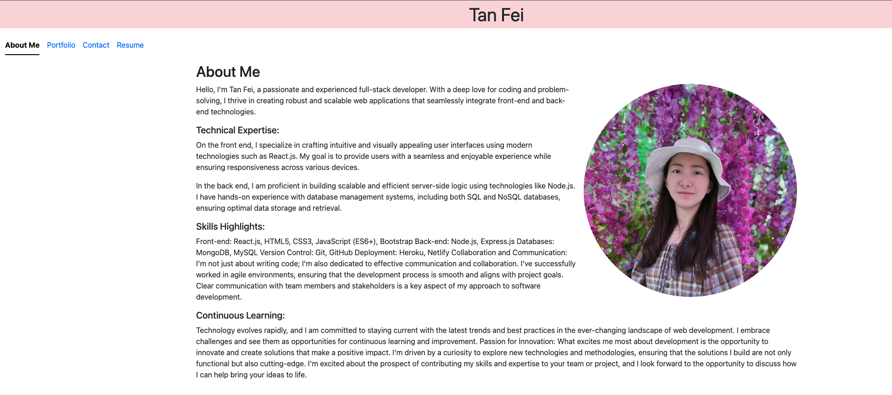

## Challenge-17-Portfolio
This is my portfoilo by using React as front-end with node and express to show you me as a developer. You can find my previous projects and contact me if you are intrested in. 

## Getting started
Please clone this repo as git@github.com:tanfei0704/challenge-17-Portfolio.git to your local  and install some of packages.

For installation, please go to terminal and run `npm install` on root package.json. And then run `npm run dev` to open it. 

Or you could open below live link for more details!!!

## Personal Portfolio

## Live demo

- [live link](https://roaring-malabi-d3aa33.netlify.app)

## Author

- [Github](https://github.com/tanfei0704)
- [LinkedIn](https://www.linkedin.com/in/tanfei2486759670/)

## Show your support
Give a ⭐ if you like this project!
